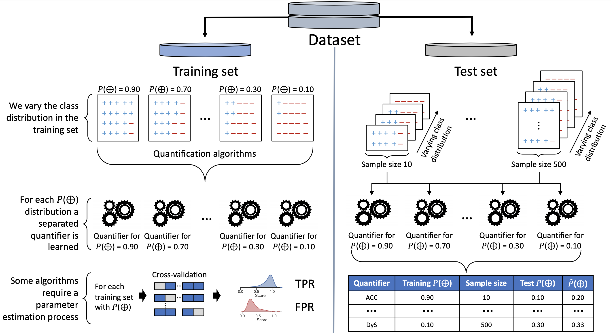

# SMM: A Simple, Efficient and Accurate Quantification Algorithm

This repository contains supplemental material for the paper. Therefore, we divide it into two parts. The following figure illustrates both parts. 

The left side of the figure represents the first part of the experiments performed over the training set. The second part, depicted on the right side of the figure, describes how each quantifier was evaluated, varying test size and class distribution. 

**PART 1:** We conduct experiments with several datasets and more than 20 quantification algorithms. First, the datasets are split into training and test sets using stratified sampling without replacement. After that, we create multiple training samples by changing the class distribution in each sample. We vary the positive class distribution in the training sample according to the following percentages: [0.05, 0.1, 0.3, 0.5, 0.7, 0.9]. Thus, we get several training samples with different positive class distributions, and then a separate model is trained for each training distribution. For each training sample, we learn a random forest classifier with 200 trees to predict the scores in the test sample. Furthermore, several quantifiers require training scores as input. For those quantifiers, we estimate the training scores for each created training sample using 10-fold stratified cross-validation. The probabilistic methods PCC and PACC require calibrated scores, which we acquire from the logistic regression method based on pair-adjacent violators. Similarly, EMQ also requires calibrated scores. We have used EMQ implementation from QuaPy framework, which also uses the logistic regression method to calibrate the scores. 

> Therefore, for each dataset, we create training and test partitions, scorers/classifiers models, estimated training scores, $fpr$, and $tpr$ rates. Some quantifiers algorithms came from the quapy package or Schumacher et al. (2020) GitHub. However, most of the codes are self-made based on literature. For the methods from the quapy package and Schumacher's GitHub, we built and saved the models in this part of the experiment. The file __experimentPreparation.py__ contains the code for completing this part.

Please, type the following command to build all the necessary artifacts for running all quantifiers over a specific dataset.

> python experimentPreparation.py dataset_name

For instance, for the dataset aedessex, type:

> python experimentPreparation.py aedessex

**PART 2:** In this part, illustrate in the right side of figure, we generate numerous test samples with different test set sizes and vary the class distribution in each sample. The test set size is essential for evaluating quantification methods. Therefore, we vary test sample sizes from 10 to 100 instances with an increment of 10 and from 100 to 500 instances with an increment of 100. In addition, the positive class distribution in each test sample varies as follows: [0.0, 0.01, 0.05, 0.1, 0.2, 0.3, 0.4, 0.5, 0.6, 0.7, 0.8, 0.9, 1]. Each quantifier is evaluated across 109,200 samples with different sizes and distributions. To reduce the error variance, we repeat the experiment 10 times.

For running this part, please, type the following command, selecting the dataset, quantifier method, number of iterations, and a boolean choice indicating if calibrated models must be used.

> python experimentRunner.py dataset_name quantifier_name  --it=number_of_interations cal=boolean_calibration

For instance, after running the python's file __experimentPreparation.py__ for the dataset aedessex, a quantifier such as SMM with 10 iterations and using calibrated scores and models, the following command must be typed:

> python experimentRunner.py aedessex SMM  --it=10